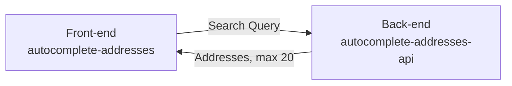

# autocomplete-addresses-api

Very simple Node.js API for autocompleting addresses built with Express + TypeScript.

Currently hosted on my Oracle Cloud ARM VM instance: https://autocomplete-addresses-api.nunogois.com

Uses [autocomplete-addresses](https://github.com/nunogois/autocomplete-addresses) as the front-end.

Since I prefer a microservice and decoupled approached compared to setting up monorepos, as always I decided to separate the front-end and back-end in different repos. Who knows, maybe this API will be consumed by other front-end apps in the future, so it should live independently.

## Getting Started

1. Clone the repo: `git clone https://github.com/nunogois/autocomplete-addresses-api.git`;
2. cd into the folder: `cd autocomplete-addresses-api`;
3. Install dependencies: `yarn` or `npm install`;
4. Run tests: `yarn test` or `npm run test`;
5. Run the server: `yarn start` or `npm run start`;

## Developer Log

Even though I wanted to use something like [trie-search](https://www.npmjs.com/package/trie-search) for the autocomplete functionality, it seems it does not support TypeScript currently. Because of that, I decided to implement my own approach in an OOP-like manner with `searchable.ts`. It's totally in-memory after reading the JSON file, so it should also be pretty fast with a similar functionality.

I considered the tests included in the `tests` folder for `router.ts` and `searchable.ts` to represent a good enough code coverage given the time available.

Also added some comments to the code, even though most are redundant, since the code is pretty self-explanatory.
